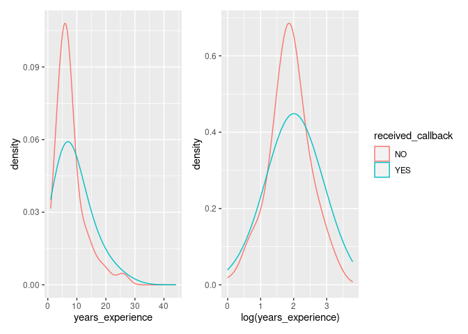

Activity 7 - Linear Discriminant Analysis
================

## Task 2: Load the necessary packages

``` r
library(tidyverse)
```

    ## ── Attaching packages ─────────────────────────────────────── tidyverse 1.3.2 ──
    ## ✔ ggplot2 3.3.6     ✔ purrr   0.3.4
    ## ✔ tibble  3.1.8     ✔ dplyr   1.0.9
    ## ✔ tidyr   1.2.0     ✔ stringr 1.4.1
    ## ✔ readr   2.1.2     ✔ forcats 0.5.2
    ## ── Conflicts ────────────────────────────────────────── tidyverse_conflicts() ──
    ## ✖ dplyr::filter() masks stats::filter()
    ## ✖ dplyr::lag()    masks stats::lag()

``` r
library(tidymodels)
```

    ## ── Attaching packages ────────────────────────────────────── tidymodels 1.0.0 ──
    ## ✔ broom        1.0.0     ✔ rsample      1.1.0
    ## ✔ dials        1.0.0     ✔ tune         1.0.0
    ## ✔ infer        1.0.3     ✔ workflows    1.0.0
    ## ✔ modeldata    1.0.0     ✔ workflowsets 1.0.0
    ## ✔ parsnip      1.0.1     ✔ yardstick    1.0.0
    ## ✔ recipes      1.0.1     
    ## ── Conflicts ───────────────────────────────────────── tidymodels_conflicts() ──
    ## ✖ scales::discard() masks purrr::discard()
    ## ✖ dplyr::filter()   masks stats::filter()
    ## ✖ recipes::fixed()  masks stringr::fixed()
    ## ✖ dplyr::lag()      masks stats::lag()
    ## ✖ yardstick::spec() masks readr::spec()
    ## ✖ recipes::step()   masks stats::step()
    ## • Use suppressPackageStartupMessages() to eliminate package startup messages

## Task 3: Load the data and visualize

``` r
resume <- read.csv("https://www.openintro.org/data/csv/resume.csv")

resume<- resume %>% mutate(received_callback = factor(received_callback, labels = c("NO", "YES")))

years <- resume %>% ggplot(aes(x=years_experience, color = received_callback, group = received_callback)) + geom_density(adjust = 4)

log_years <- resume %>% ggplot(aes(x=log(years_experience), color = received_callback, group = received_callback)) + geom_density(adjust = 4)

library(patchwork)

years + log_years + plot_layout(guides = "collect")
```

<!-- -->

## Task 4: LDA

``` r
# Convert received_callback to a factor with more informative labels

resume <- resume %>% 
  mutate(received_callback = factor(received_callback, labels = c("No", "Yes")))

#LDA

library(discrim)
```

    ## 
    ## Attaching package: 'discrim'

    ## The following object is masked from 'package:dials':
    ## 
    ##     smoothness

``` r
lda_years <- discrim_linear() %>% 
  set_mode("classification") %>% 
  set_engine("MASS") %>% 
  fit(received_callback ~ log(years_experience), data = resume)

lda_years
```

    ## parsnip model object
    ## 
    ## Call:
    ## lda(received_callback ~ log(years_experience), data = data)
    ## 
    ## Prior probabilities of groups:
    ##         No        Yes 
    ## 0.91950719 0.08049281 
    ## 
    ## Group means:
    ##     log(years_experience)
    ## No               1.867135
    ## Yes              1.998715
    ## 
    ## Coefficients of linear discriminants:
    ##                            LD1
    ## log(years_experience) 1.638023

## Task 5: Predictions

``` r
predict(lda_years, new_data = resume, type = "prob")
```

    ## # A tibble: 4,870 × 2
    ##    .pred_No .pred_Yes
    ##       <dbl>     <dbl>
    ##  1    0.923    0.0769
    ##  2    0.923    0.0769
    ##  3    0.923    0.0769
    ##  4    0.923    0.0769
    ##  5    0.884    0.116 
    ##  6    0.923    0.0769
    ##  7    0.928    0.0724
    ##  8    0.885    0.115 
    ##  9    0.939    0.0612
    ## 10    0.923    0.0769
    ## # … with 4,860 more rows

``` r
augment(lda_years, new_data = resume) %>% 
  conf_mat(truth = received_callback, estimate = .pred_class)
```

    ##           Truth
    ## Prediction   No  Yes
    ##        No  4478  392
    ##        Yes    0    0

``` r
augment(lda_years, new_data = resume) %>% 
  accuracy(truth = received_callback, estimate = .pred_class)
```

    ## # A tibble: 1 × 3
    ##   .metric  .estimator .estimate
    ##   <chr>    <chr>          <dbl>
    ## 1 accuracy binary         0.920
